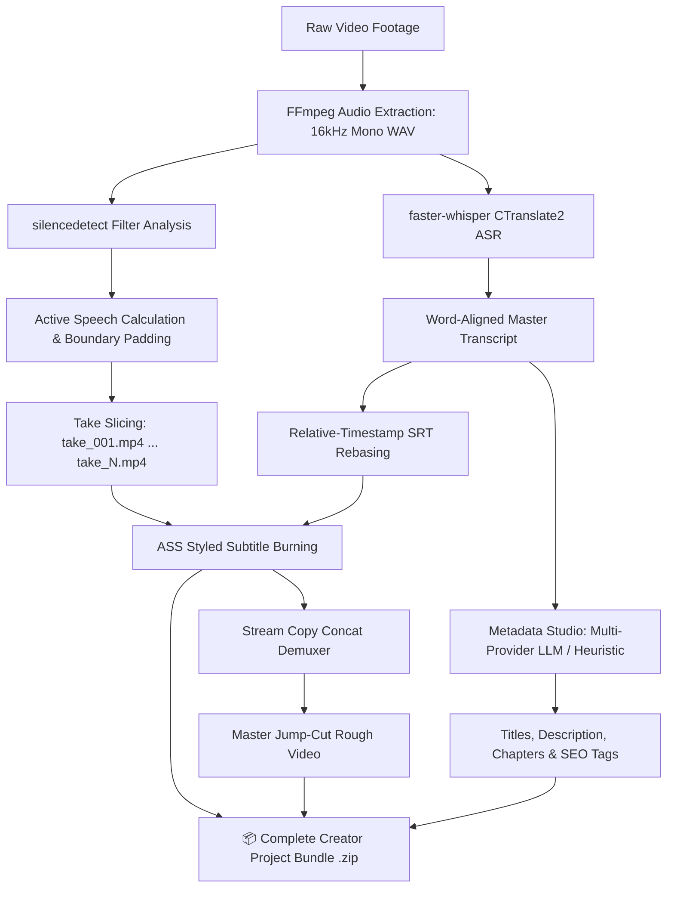

# ⚡ AutoChop AI Studio (v2)

<p align="center">
  
</p>

<p align="center">
  <a href="https://github.com/Akubrecah/AutoChop/actions"></a>
  <a href="https://www.python.org/downloads/"></a>
  <a href="https://ffmpeg.org/"></a>
  <a href="https://github.com/SYSTRAN/faster-whisper"></a>
  <a href="https://gradio.app/"></a>
  <a href="LICENSE"></a>
</p>

---

## 📑 Table of Contents
1. [Overview & Problem Statement](#-overview--problem-statement)
2. [Key Features & Capabilities](#-key-features--capabilities)
3. [Architecture & Pipeline Flow](#-architecture--pipeline-flow)
4. [Installation & Prerequisites](#-installation--prerequisites)
   - [FFmpeg Setup (macOS / Linux / Windows)](#1-ffmpeg-setup)
   - [Python Environment Setup (uv & venv)](#2-python-environment-setup)
5. [Step-by-Step Usage Guide](#-step-by-step-usage-guide)
   - [Tab 1: Video Cuts & Captions](#tab-1-video-cuts--captions)
   - [Tab 2: Title & Chapter Studio](#tab-2-title--chapter-studio)
   - [Tab 3: API Keys & Provider Settings](#tab-3-api-keys--provider-settings)
6. [Tunable Parameters & Configuration](#-tunable-parameters--configuration)
7. [Testing & Quality Assurance](#-testing--quality-assurance)
8. [Multi-Provider AI Hub & Offline Heuristics](#-multi-provider-ai-hub--offline-heuristics)
9. [Troubleshooting & FAQs](#-troubleshooting--faqs)
10. [Security & Privacy](#-security--privacy)
11. [Acknowledgements & License](#-acknowledgements--license)

---

## 🎯 Overview & Problem Statement

Every content creator, video editor, and educator faces the exact same mechanical barrier: **the first three hours of the edit**.

Before any creative storytelling can occur, creators must:
- Scrub through long raw recordings to manually slice out awkward pauses, "ums", and silences.
- Transcribe audio word-for-word and align subtitle timestamps.
- Format and position high-contrast captions suitable for mobile viewers.
- Listen back through the video to write YouTube chapter markers and SEO descriptions.

Existing cloud-based video editing SaaS tools charge expensive monthly subscription fees, enforce strict upload file size quotas, and compromise privacy by sending unreleased video footage to remote servers.

**AutoChop AI Studio** is a local-first, privacy-preserving, high-throughput automated post-production workstation. Powered by **FFmpeg**, **faster-whisper** (CTranslate2), and a responsive **Gradio Studio UI**, AutoChop automates this entire manual workflow on your machine in **under 30 seconds**.

---

## ✨ Key Features & Capabilities

### 1. ✂️ Intelligent Dead-Air Stripping
- **Two-Pass Decibel Thresholding:** Analyzes raw audio via FFmpeg's `silencedetect` filter to locate pauses below a configurable threshold (default: `-30dB`).
- **Mathematical Boundary Padding:** Inverts silence intervals into speech takes with safe onset and decay buffers ($\delta_{\text{pad}} = 0.15\text{s}$), ensuring opening and ending consonants (like 'p', 't', 'k') are never clipped.
- **Micro-Pause Retention:** Pauses shorter than $0.2\text{s}$ are preserved as natural breathing rhythms so speech never sounds robotic or artificially rushed.
- **Short Noise Artifact Rejection:** Discards transient clicks, mic bumps, and coughing artifacts shorter than $0.1\text{s}$.

### 2. 🎙️ High-Speed On-Device Speech Recognition
- **CTranslate2 Optimization:** Powered by `faster-whisper` with 8-bit quantization (`int8`), delivering up to **4x faster execution** than OpenAI's vanilla Whisper model while reducing RAM usage by 60%.
- **Silero VAD Filtering:** Integrated Voice Activity Detection filters out non-speech background hum prior to ASR inference.
- **Relative Timestamp Rebasing:** Automatically rebases global transcript timestamps relative to each sliced take ($00:00.000$), generating individual, ready-to-use `.srt` files for every cut.

### 3. 🎨 High-Contrast Styled Subtitle Burning
- **Advanced SubStation Alpha (ASS) Engine:** Hardcodes crisp, styled social captions directly into video slices using libass.
- **Resolution-Adaptive Coordinate Matrices:** Dynamically calculates `PlayResX` and `PlayResY` coordinate matrices to ensure pixel-perfect subtitle scaling across widescreen (16:9), vertical phone reels (9:16), and square (1:1) formats.
- **Creator Presets:**
  - **TikTok Yellow Box:** High-impact yellow fill (`#FFE600`) with rounded dark background box, black outline, and bold drop shadow.
  - **Clean Minimalist:** Subtle semi-transparent dark backing box with crisp white text.
  - **High-Contrast White:** Clean white font with thick black outline and strong shadow.

### 4. 🎞️ Keyframe-Accurate Slicing & Master Assembly
- **Zero-Transcode Concat Demuxer:** Concatenates all active speech takes into a master rough cut at disk I/O speeds using FFmpeg's stream copy demuxer.
- **A/V Sync Drift Protection:** Enforces 44.1kHz audio normalization and resets presentation timestamps (`setpts=PTS-STARTPTS`, `asetpts=PTS-STARTPTS`) on each slice to prevent lip-sync drift.
- **Auto-Re-encode Fallback:** If input footage contains non-uniform codecs or variable frame rates, the pipeline seamlessly falls back to an encoded `filter_complex` concatenation to guarantee output playback.

### 5. 🚀 AI Metadata & YouTube Chapter Studio
- **Multi-Provider AI Hub:** Connects to **OpenAI**, **NVIDIA NIM**, **Google Gemini**, **Anthropic Claude**, **Groq**, **Grok (xAI)**, or custom self-hosted endpoints (e.g. Ollama, OpenCode).
- **100% Offline Heuristic Engine:** Includes a zero-key local fallback that mathematically analyzes the transcript to produce compliant chapters and copy even without an internet connection or API keys.
- **YouTube Chapter Compliance:** Strictly guarantees YouTube's algorithm requirements:
  - First chapter always starts at `00:00`.
  - Minimum of 3 distinct timestamped chapters.
  - Each chapter spans at least 10 seconds.
- **Full Metadata Suite:** Generates 5 high-CTR click-worthy titles, a 2-sentence description hook, structured chapters, and comma-separated SEO tags.

### 6. 📦 One-Click Creator Bundle Export
- Compiles the entire session into a downloadable `.zip` archive containing:
  - `master_rough_cut.mp4`: Complete assembled jump-cut video.
  - `takes/`: Individual numbered video takes (`take_001.mp4`, `take_002.mp4`, ...).
  - `subtitles/`: Time-aligned `.srt` files for every take and the master video.
  - `edit_manifest.md`: Comprehensive GitHub Markdown manifest detailing take durations, timestamps, and cut statistics.

---

## 🏗️ Architecture & Pipeline Flow

```
autochop/
├── app.py                  # Gradio Blocks UI (3 Tabs, custom studio theme & CSS)
├── config.py               # Constants, defaults, and ASS subtitle typography presets
├── core/
│   ├── audio.py            # Module 1: duration probing, 16kHz WAV extraction, silence inversion
│   ├── transcription.py    # Module 2: faster-whisper worker, SRT rebasing, ASS burning
│   ├── assembly.py         # Module 3: take slicing, concat demuxer, markdown manifest, zip bundle
│   └── metadata.py         # Module 4: multi-provider AI hub & zero-key heuristic chapter generator
├── utils/
│   ├── env_utils.py        # Secure .env persistence and multi-provider key validation
│   ├── ffmpeg_utils.py     # Binary verification, subprocess executor, path escaping
│   └── file_utils.py       # Session-scoped temp directories and zip packager
├── tests/                  # Complete test suite (19 unit & integration tests)
├── assets/                 # Brand thumbnails, hero banners, and media assets
├── requirements.txt        # Production dependencies
├── pyproject.toml          # Project configuration and metadata
├── .env.example            # Environment template (API keys strictly excluded)
└── LICENSE                 # Official MIT License
```

### Media Pipeline Flowchart



---

## 🚀 Installation & Prerequisites

### 1. FFmpeg Setup

AutoChop requires `ffmpeg` and `ffprobe` ($\ge 5.0$) accessible in your system `PATH`.

#### macOS (Homebrew)
```bash
brew install ffmpeg
```

#### Ubuntu / Debian
```bash
sudo apt update && sudo apt install -y ffmpeg
```

#### Windows (winget or Chocolatey)
```powershell
winget install Gyan.FFmpeg
# or
choco install ffmpeg
```

#### Verify Installation
```bash
ffmpeg -version
ffprobe -version
```

---

### 2. Python Environment Setup

AutoChop supports **Python 3.10+** (Python 3.11 recommended).

#### Option A: Using `uv` (Recommended - Ultra Fast)
```bash
# Clone the repository
git clone https://github.com/Akubrecah/AutoChop.git
cd AutoChop

# Create and activate virtual environment
uv venv .venv --python 3.11
source .venv/bin/activate    # On Windows: .venv\Scripts\activate

# Install dependencies
uv pip install -r requirements.txt
```

#### Option B: Using standard `venv` & `pip`
```bash
git clone https://github.com/Akubrecah/AutoChop.git
cd AutoChop

python3 -m venv .venv
source .venv/bin/activate    # On Windows: .venv\Scripts\activate

pip install --upgrade pip
pip install -r requirements.txt
```

---

## 💻 Step-by-Step Usage Guide

### Launching the Application

Run the server locally:
```bash
python app.py
```

Open your browser and navigate to:
```
http://localhost:7860
```

---

### Tab 1: Video Cuts & Captions

1. **Upload Raw Video:** Drag and drop your raw MP4, MOV, MKV, or AVI footage into the **Upload Raw Video Footage** box.
2. **Adjust Processing Settings (Optional):**
   - **Silence Detection Threshold (dB):** Set audio cutoff (default: `-30dB`). For noisy environments, set closer to `-25dB`.
   - **Minimum Silence Duration (s):** Minimum pause length to strip (default: `0.5s`).
   - **Whisper Model:** Select transcription model size (`base` recommended for fast CPU inference; `small` or `medium` for higher precision).
   - **Caption Style Preset:** Choose between **TikTok Yellow Box**, **Clean Minimalist**, or **High-Contrast White**.
   - **Max Output Resolution:** Keep original or auto-downscale 4K recordings to 1080p/720p for 4x faster processing.
3. **Execute:** Click **🎬 Cut, Transcribe & Burn**.
4. **Preview & Download:**
   - Watch the **Master Jump-Cut Rough Video** directly in the browser player.
   - Use the **Take Inspector** accordion to preview individual sliced takes.
   - Inspect the **Edit Manifest** table for cut durations and percentages.
   - Click **📦 Download Complete Project Bundle (.zip)** to save all takes, SRTs, and manifest files.

---

### Tab 2: Title & Chapter Studio

1. **Transcript Auto-Sync:** The spoken transcript generated in Tab 1 automatically populates the transcript area. You can also paste external transcripts manually.
2. **Select Engine:** Choose your preferred generator:
   - `Local Heuristic (No Key)`: 100% offline, requires no API key.
   - `OpenAI`, `NVIDIA NIM`, `Google Gemini`, `Anthropic Claude`, `Groq`, `Grok (xAI)`, or `Custom Endpoint`.
3. **Generate:** Click **✨ Generate Titles, Description & Chapters**.
4. **One-Click Copy:** Use the dedicated copy buttons to instantly grab:
   - 📋 5 Click-Worthy Titles
   - 📋 2-Sentence Video Description Hook
   - 📋 YouTube-Compliant Timestamp Chapters
   - 📋 SEO Tags

---

### Tab 3: API Keys & Provider Settings

1. Select your AI provider from the dropdown.
2. Paste your API key (e.g., `nvapi-...`, `sk-...`, `gsk_...`).
3. Click **💾 Save API Key**.
4. The key is securely validated against provider format rules and saved into your local `.env` file (which is strictly ignored by Git and never committed).

---

## ⚙️ Tunable Parameters & Configuration

All core settings can be customized in the UI or modified globally in [config.py](config.py):

| Parameter | Default | Recommended Range | Description |
| :--- | :---: | :---: | :--- |
| `SILENCE_THRESH_DB` | `-30.0 dB` | `-45.0` to `-20.0 dB` | Audio below this volume is flagged as dead air. |
| `MIN_SILENCE_SEC` | `0.50 s` | `0.20` to `2.00 s` | Pauses shorter than this duration are kept intact. |
| `PADDING_START_SEC` | `0.15 s` | `0.10` to `0.30 s` | Time added before active speech to preserve opening consonants. |
| `PADDING_END_SEC` | `0.15 s` | `0.10` to `0.30 s` | Time added after active speech to prevent abrupt audio cutoffs. |
| `MIN_SPEECH_SEC` | `0.10 s` | `0.05` to `0.30 s` | Noise spikes shorter than this duration are rejected. |
| `MERGE_GAP_SEC` | `0.20 s` | `0.10` to `0.40 s` | Breathing pauses between takes are merged to preserve natural flow. |
| `WHISPER_MODEL` | `base` | `tiny` to `large-v3` | Model size for faster-whisper transcription engine. |

---

## 🧪 Testing & Quality Assurance

AutoChop includes a comprehensive automated test suite verifying every component without requiring manual video uploads.

### Run All Tests
```bash
pytest tests/ -v
```

### Test Suite Breakdown (19 Tests)
- **`tests/test_audio.py` (7 tests):**
  - Validates silence inversion, safety boundary padding, micro-gap merging, noise rejection, and error handling for all-silent inputs.
- **`tests/test_transcription.py` (4 tests):**
  - Validates SRT millisecond timestamp formatting, relative take rebasing, zero-duration edge cases, and empty fallback handling.
- **`tests/test_assembly.py` (1 test):**
  - Verifies edit manifest generation, table structure, and cut percentage statistics.
- **`tests/test_metadata.py` (6 tests):**
  - Validates zero-key heuristic YouTube chapter compliance, fallback routing, API key formatting, and `.env` persistence.
- **`tests/test_integration.py` (1 test):**
  - Programmatically synthesizes an audio/video clip using FFmpeg, generates silence, and executes the complete pipeline end-to-end.

---

## 🌐 Multi-Provider AI Hub & Offline Heuristics

AutoChop features an OpenAI-compatible universal adapter supporting a wide array of AI inference engines:

| Provider | Supported Models | Default Model | Key Prefix |
| :--- | :--- | :--- | :--- |
| **Local Heuristic** | Built-in NLP Regex Parser | *None required* | *None* |
| **NVIDIA NIM** | Meta LLaMA 3.3 70B, Mistral Large | `meta/llama-3.3-70b-instruct` | `nvapi-...` |
| **OpenAI** | GPT-4o, GPT-4o-mini | `gpt-4o-mini` | `sk-...` |
| **Google Gemini** | Gemini 1.5 Pro, Gemini 1.5 Flash | `gemini-1.5-flash` | `AIzaSy...` |
| **Groq Cloud** | LLaMA 3.3 70B Versatile, Mixtral | `llama-3.3-70b-versatile` | `gsk_...` |
| **Anthropic Claude** | Claude 3.5 Sonnet, Claude 3 Haiku | `claude-3-5-sonnet-latest` | `sk-ant-...` |
| **xAI Grok** | Grok 2, Grok Beta | `grok-beta` | `xai-...` |
| **Custom Endpoint** | Ollama, vLLM, OpenCode, LM Studio | User Configurable | User Configurable |

---

## ❓ Troubleshooting & FAQs

### 1. `FileNotFoundError: ffmpeg not found in PATH`
- Ensure FFmpeg is installed and accessible in your shell:
  ```bash
  which ffmpeg
  which ffprobe
  ```
- If running inside a virtual environment on macOS, ensure `/opt/homebrew/bin` is in your environment `PATH`.

### 2. Slicing takes longer than expected
- Set **Whisper Transcription Model** to `tiny` or `base` for faster CPU inference.
- Select `1080p` or `720p` in **Max Output Resolution** if uploading high-bitrate 4K screen recordings.

### 3. Audio/Video synchronization issues in custom video formats
- AutoChop automatically falls back to `filter_complex` re-encoding if stream copy fails. Ensure your video has a standard constant frame rate (CFR) where possible.

---

## 🛡️ Security & Privacy

- **100% Local Execution:** Media processing (FFmpeg) and transcription (`faster-whisper`) execute entirely on your machine. Your unreleased video files are never uploaded to any remote server.
- **Isolated API Keys:** All user-entered keys are stored locally in `.env` and are strictly excluded from version control via `.gitignore`.
- **Session-Scoped Storage:** Temporary working directories (`~/.autochop/tmp/session_*`) are isolated by session UUID to prevent file collisions.

---

## 📜 Acknowledgements & Attributions

AutoChop AI Studio stands on the shoulders of these incredible open-source projects:
- **[FFmpeg](https://ffmpeg.org/)** — The gold-standard multimedia framework for filtering, transcoding, and stream multiplexing.
- **[faster-whisper](https://github.com/SYSTRAN/faster-whisper)** — Fast Whisper inference using CTranslate2.
- **[Gradio](https://github.com/gradio-app/gradio)** — Intuitive and powerful web UI framework for machine learning tools.
- **[Silero VAD](https://github.com/snakers4/silero-vad)** — High-performance pre-trained enterprise Voice Activity Detector.

---

## 📄 License

This project is licensed under the **MIT License** — see the [LICENSE](LICENSE) file for complete details.

Copyright (c) 2026 Akubrecah. All rights reserved.
